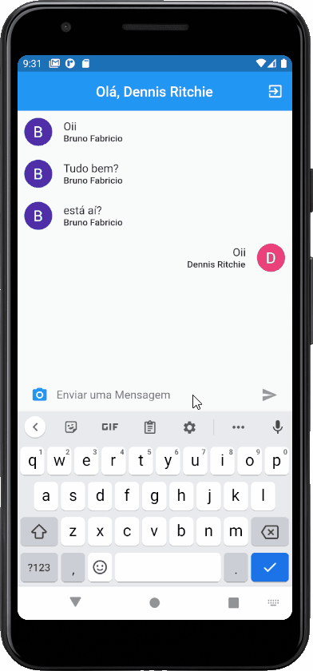

# Online chat

## ✏️ About
This Project has developed to create an real time online chat

## 📱 Preview

  

## 💻 Technologies 

## 🧠 what I learned in this class:
- Use Firebase like BaaS(Backend as a Service)
- OAuth with google
- create database to our applications