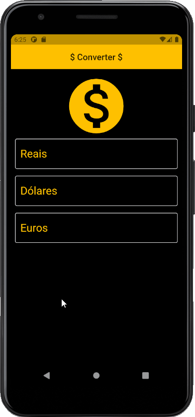

# Converter App

## ✏️ About
This Project has developed to convert currencies

## 📱 Preview

## 💻 Technologies 

## 🧠 what I learned in this class:
- We need to use an async function because when we will communicate with another machine we must await a response 
- Json to communication between client and server
- create api key in https://hgbrasil.com/status/finance