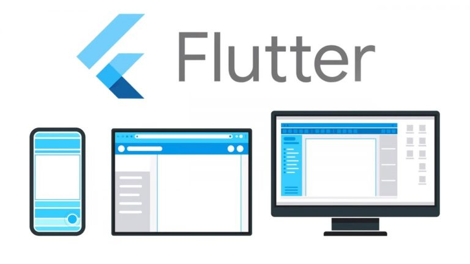

<h1 align="center"> Flutter Course 2020 </h1>

# About: 
💻 This course contains 16 applications developed to the mobile phone __Android and IOS__

# Applications developed in this course:

- OLX Clone ( olx.com.br )
- Virtual Store (Client App and Manager App) 
- Online Chat
- Contact Book
- Youtube Favorites
- To Do List
- Coin Converter
- Gifs Search
- IMC Calculator
- And More!